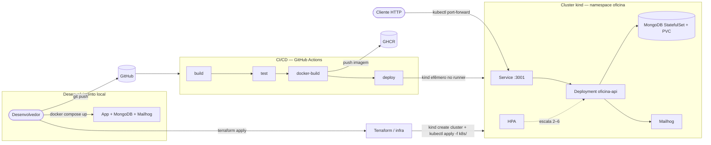

# Auto Repair Shop Management System

Sistema de gestão para oficinas mecânicas desenvolvido com **Domain-Driven Design (DDD)** e arquitetura em camadas, como Tech Challenge da Pós-Tech SOAT FIAP.

**Fase 1** entregou a aplicação (API REST completa, DDD em camadas, testes, Swagger).
**Fase 2** evolui essa base para produção: reforço de Clean Architecture, testes de
integração/E2E com Mongo real, containerização, Kubernetes com autoscaling,
provisionamento via Terraform e um pipeline de CI/CD completo. Ver
[`docs/PHASE_2_PLAN.md`](docs/PHASE_2_PLAN.md) e [`docs/PHASE_2_TASKS.md`](docs/PHASE_2_TASKS.md)
para o planejamento e o checklist detalhado da Fase 2 (arquivos locais, fora do
controle de versão — ver `.gitignore`).

---

## Objetivos

Implementar um sistema integrado que permita à oficina:

- Cadastrar e gerenciar **clientes** (PF e PJ com validação de CPF/CNPJ) e seus **veículos**
- Manter um **catálogo de peças** com controle de preços, margens e estoque
- Manter um **catálogo de serviços** com preço e tempo estimado
- Abrir, executar e encerrar **ordens de serviço** com controle de ciclo de vida
  (`RECEBIDA → EM_DIAGNOSTICO → AGUARDANDO_APROVACAO → EM_EXECUCAO → FINALIZADA → ENTREGUE`,
  com `CANCELADA` a partir dos estados não finais)
- Notificar o cliente por **e-mail** a cada mudança de status da OS
- Receber a **aprovação/recusa de orçamento** do cliente via webhook externo
- Registrar **pagamentos** em múltiplas formas
- Consultar um **dashboard** com métricas de operação

**Objetivos da Fase 2**: preparar essa aplicação para rodar de forma produtiva —
containerizada, orquestrada com autoscaling, provisionada via infraestrutura como
código, e implantada por um pipeline de CI/CD — mantendo a cobertura de testes e a
qualidade de código da Fase 1.

---

## Stack

| Camada | Tecnologia |
|---|---|
| Runtime | Node.js 20+ |
| Linguagem | TypeScript 5+ (strict) |
| Framework | Express.js 5 |
| Banco de dados | MongoDB 7 + Mongoose |
| E-mail | Nodemailer (SMTP) + Mailhog (dev/local) |
| Testes | Jest + ts-jest + Supertest + `mongodb-memory-server` |
| Documentação | Swagger UI / OpenAPI 3.0 |
| Container | Docker + Docker Compose |
| Orquestração | Kubernetes (manifests em `k8s/`, cluster local via `kind`) |
| Infraestrutura como código | Terraform (`infra/`) |
| CI/CD | GitHub Actions (`.github/workflows/ci-cd.yml`) |
| Qualidade | SonarQube + SonarScanner |
| Segurança | JWT, bcrypt, Helmet, rate limiting |

---

## Arquitetura

```
src/
├── domain/           # Entidades, value objects, regras de negócio, interfaces de repo e de serviços (ports)
├── application/      # Use cases, DTOs, mappers
├── infrastructure/   # MongoDB schemas/repos, Nodemailer, serviços de segurança
├── presentation/     # Controllers, routes, middlewares, validators
├── main/              # Composition root (factories que fazem o wiring de dependências)
└── shared/            # Erros de domínio
```

**Princípios aplicados**: Aggregate Roots, Value Objects (CPF/CNPJ, Placa, Endereço),
Repository Pattern, Ports & Adapters para integrações externas (`INotificationService`
→ `NodemailerNotificationService`), composition root isolando a montagem de
dependências da camada de rotas, imutabilidade em todas as entidades de domínio, TDD.

### Fluxo de infraestrutura (Fase 2)



Detalhes de cada etapa: [`k8s/README.md`](k8s/README.md) (manifestos Kubernetes) e
[`infra/README.md`](infra/README.md) (Terraform).

---

## Quick Start

### Pré-requisitos

- Node.js 20+
- Docker e Docker Compose

### 1. Configurar variáveis de ambiente

```bash
cp .env.example .env
# edite .env — defina MONGO_PASSWORD, JWT_SECRET, WEBHOOK_SECRET e SONAR_TOKEN
```

### 2. Subir os serviços

```bash
docker compose up -d
```

Aguarde ~15 s para o MongoDB inicializar. A API ficará disponível em
`http://localhost:3001`, e o Mailhog (captura os e-mails enviados pela API) em
`http://localhost:8025`.

### 3. Desenvolvimento local (sem Docker para a API)

```bash
npm install
docker compose up -d mongodb mailhog   # apenas as dependências
npm run dev
```

---

## Kubernetes e Terraform

Para rodar em um cluster **kind** local (com autoscaling via HPA):

```bash
cd infra
cp terraform.tfvars.example terraform.tfvars   # preencha os valores
terraform init
terraform apply
```

Isso cria o cluster, builda e carrega a imagem da API, e aplica todos os manifestos de
`k8s/` (namespace, ConfigMap/Secret, MongoDB, Mailhog, Deployment, Service, HPA).
Passo a passo detalhado, incluindo como instalar o `metrics-server` (necessário para o
HPA funcionar em `kind`) e como gerar carga para observar o autoscaling:
[`infra/README.md`](infra/README.md) e [`k8s/README.md`](k8s/README.md).

Para aplicar os manifestos manualmente (sem Terraform), veja o passo a passo em
[`k8s/README.md`](k8s/README.md).

---

## API

### Autenticação

Endpoints marcados como protegidos exigem token JWT no header:

```
Authorization: Bearer <token>
```

**Obter token:**

```bash
POST /api/auth/login
{ "email": "admin@oficina.com", "senha": "senha123" }
```

> ⚠️ Não há usuário seedado por padrão — os scripts `npm run db:seed`/`db:reset`
> referenciam arquivos que ainda não existem no projeto. Crie um usuário diretamente
> no MongoDB (`users` collection, com `senhaHash` gerado via bcrypt) antes de testar o
> login. Ver [Notas e limitações conhecidas](#notas-e-limitações-conhecidas).

### Endpoints

| Método | Rota | Auth | Descrição |
|--------|------|:---:|-----------|
| `GET` | `/health` | — | Health check (200 se MongoDB conectado, 503 caso contrário) |
| `POST` | `/api/auth/login` | — | Login |
| `POST` | `/api/clientes` | JWT | Criar cliente |
| `GET` | `/api/clientes` | JWT | Listar clientes |
| `GET` | `/api/clientes/:id` | JWT | Buscar cliente |
| `PUT` | `/api/clientes/:id` | JWT | Atualizar cliente |
| `DELETE` | `/api/clientes/:id` | JWT | Desativar cliente |
| `GET` | `/api/clientes/:id/veiculos` | JWT | Listar veículos do cliente |
| `POST` | `/api/veiculos` | JWT | Criar veículo |
| `GET` | `/api/veiculos/:id` | JWT | Buscar veículo |
| `PUT` | `/api/veiculos/:id` | JWT | Atualizar veículo |
| `POST` | `/api/pecas` | JWT | Criar peça |
| `GET` | `/api/pecas` | JWT | Listar peças (filtros: categoria, search) |
| `GET` | `/api/pecas/:id` | JWT | Buscar peça |
| `PUT` | `/api/pecas/:id` | JWT | Atualizar preço/níveis |
| `DELETE` | `/api/pecas/:id` | JWT | Desativar peça |
| `POST` | `/api/servicos` | JWT | Criar serviço no catálogo |
| `GET` | `/api/servicos` | JWT | Listar serviços |
| `GET` | `/api/servicos/:id` | JWT | Buscar serviço |
| `PUT` | `/api/servicos/:id` | JWT | Editar serviço |
| `DELETE` | `/api/servicos/:id` | JWT | Deletar serviço (soft delete) |
| `POST` | `/api/ordens-servico` | JWT | Criar OS (a partir de cpfCnpj + placa; aceita itens do catálogo de serviços) |
| `GET` | `/api/ordens-servico` | JWT | Listar OS (filtros: status, clienteId, veiculoId) — ordenada por status (execução primeiro) e esconde `FINALIZADA`/`ENTREGUE` por padrão |
| `GET` | `/api/ordens-servico/:id` | JWT | Buscar OS por id |
| `GET` | `/api/ordens-servico/buscar?cpfCnpj=` | — | Consulta pública de OS pelo CPF/CNPJ do cliente |
| `PATCH` | `/api/ordens-servico/:id/iniciar` | JWT | `RECEBIDA → EM_DIAGNOSTICO` |
| `PATCH` | `/api/ordens-servico/:id/aguardar-aprovacao` | JWT | `EM_DIAGNOSTICO → AGUARDANDO_APROVACAO` |
| `PATCH` | `/api/ordens-servico/:id/aprovar` | JWT | `AGUARDANDO_APROVACAO → EM_EXECUCAO` (uso interno) |
| `POST` | `/api/ordens-servico/:id/orcamento/webhook` | secret | Aprovação/recusa do orçamento pelo cliente (notificação externa) — `{ aprovado, motivo? }`; aprova ou cancela a OS |
| `PATCH` | `/api/ordens-servico/:id/concluir` | JWT | `EM_EXECUCAO → FINALIZADA` |
| `PATCH` | `/api/ordens-servico/:id/entregar` | JWT | `FINALIZADA → ENTREGUE` |
| `PATCH` | `/api/ordens-servico/:id/cancelar` | JWT | Cancela a OS (body: `{ motivo }`) |
| `POST` | `/api/pagamentos` | JWT | Registrar pagamento |
| `GET` | `/api/pagamentos` | JWT | Listar pagamentos |
| `GET` | `/api/pagamentos/:id` | JWT | Buscar pagamento |
| `GET` | `/api/relatorios/dashboard` | JWT | Dashboard com métricas |

O webhook de aprovação de orçamento usa um segredo compartilhado em vez de JWT de
usuário — envie o header `x-webhook-secret` com o valor configurado em `WEBHOOK_SECRET`.

A cada transição de status da OS (`iniciar`, `aguardar-aprovacao`, `aprovar`/webhook,
`concluir`, `entregar`, `cancelar`), a API dispara — de forma assíncrona, sem bloquear
a resposta HTTP — um e-mail de atualização para o cliente (Mailhog em dev/local).

### Documentação interativa

Com a API rodando, acesse:

- **Swagger UI**: http://localhost:3001/api/docs
- **OpenAPI JSON**: http://localhost:3001/api/docs.json

Para importar no Postman/Insomnia: **Import → Link** apontando para
`http://localhost:3001/api/docs.json` — não há uma collection `.json` separada
versionada no repositório, o Swagger já serve como fonte única.

---

## Testes

```bash
npm test                  # todos os testes
npm run test:coverage     # com relatório de cobertura
npm run test:watch        # modo watch
npm run test:unit         # só tests/domain (unitários)
npm run test:integration  # só tests/integration (E2E via supertest)
```

**Cobertura atual**: Statements 97,7% | Branches 95,1% | Functions 93,5% | Lines 98,1%
(threshold mínimo: 80%, configurado em `jest.config.js`) — 606 testes.

Inclui testes de integração reais contra MongoDB (via `mongodb-memory-server`, sem
depender de Docker) e testes E2E ponta a ponta do ciclo de vida da OS e da
listagem/ordenação via HTTP (`tests/integration/`).

---

## Qualidade — SonarQube

```bash
# Subir SonarQube (http://localhost:9000 — admin/admin no primeiro acesso)
npm run sonar:up

# Gerar cobertura e enviar análise
npm run sonar:scan

# Parar SonarQube
npm run sonar:down
```

Após o primeiro login no SonarQube, gere um token em **My Account → Security** e adicione ao `.env`:

```
SONAR_TOKEN=seu-token-aqui
```

---

## CI/CD

Pipeline em `.github/workflows/ci-cd.yml`, com 4 jobs sequenciais a cada push/PR na
branch `main` (e em tags `v*`):

1. **build** — `npm ci` + `npm run build` (compila TypeScript).
2. **test** — `npm run test:coverage` contra um MongoDB real (service container), com
   os thresholds do `jest.config.js` (mínimo 80%) como gate; publica o relatório de
   cobertura como artefato do workflow e um resumo no sumário da execução.
3. **docker-build** — builda a imagem e publica em `ghcr.io/<owner>/<repo>` (tags
   `latest` e `<sha>`). Só publica em push para `main`/tag; em PRs só builda, para
   validar o `Dockerfile` sem exigir permissão de escrita no registry.
4. **deploy** — só roda em push para `main` ou tag `v*`. Sobe um cluster **kind
   efêmero dentro do próprio runner**, carrega a imagem recém-buildada e aplica todos
   os manifestos de `k8s/`, espera o rollout e faz um smoke test em `/health`. Ver a
   justificativa dessa escolha (em vez de um cluster remoto persistente) nos
   comentários do próprio workflow e em `infra/README.md`.

### Secrets do GitHub

Com o design atual (kind efêmero por execução), **nenhum secret adicional é
necessário** — o job `docker-build` usa o `GITHUB_TOKEN` automático do Actions
(permissão `packages: write`) para publicar no GHCR, e o job `deploy` usa valores de
demonstração descartáveis (o cluster não sobrevive além do job).

Se este pipeline for apontado para um cluster remoto persistente no futuro, os secrets
a configurar em **Settings → Secrets and variables → Actions** seriam:

| Secret | Uso |
|---|---|
| `KUBE_CONFIG` | Kubeconfig (base64) do cluster de destino, para `kubectl config use-context` no job `deploy` em vez de criar um kind efêmero |
| `MONGO_ROOT_PASSWORD` | Senha root do MongoDB do cluster de destino |
| `JWT_SECRET` | Segredo de assinatura dos JWTs da API |
| `WEBHOOK_SECRET` | Segredo do header `x-webhook-secret` do endpoint de aprovação de orçamento |
| `SMTP_USER` / `SMTP_PASS` | Credenciais de um provedor SMTP real (SES/SendGrid), no lugar do Mailhog local |

Nenhum valor real desses secrets está neste repositório.

---

## Scripts

```bash
npm run dev             # servidor em modo desenvolvimento (hot reload)
npm run build           # compila TypeScript
npm run start           # inicia versão compilada (produção)
npm run lint            # ESLint (⚠️ ver Notas e limitações conhecidas)
npm run lint:fix        # ESLint com auto-fix
npm run type-check      # verificação de tipos TypeScript
npm run docker:up       # sobe todos os serviços Docker
npm run docker:down     # para todos os serviços Docker
npm run docker:logs     # logs dos serviços em tempo real
```

---

## Fluxo Principal

```
1. POST /api/auth/login                          → obter token JWT
2. POST /api/clientes                             → cadastrar cliente
3. POST /api/veiculos                             → cadastrar veículo vinculado ao cliente
4. POST /api/pecas                                 → cadastrar peças no catálogo
5. POST /api/servicos                              → cadastrar serviços no catálogo
6. POST /api/ordens-servico                        → abrir OS (RECEBIDA)
7. PATCH /api/ordens-servico/:id/iniciar            → iniciar diagnóstico (EM_DIAGNOSTICO)
8. PATCH /api/ordens-servico/:id/aguardar-aprovacao → orçamento pronto (AGUARDANDO_APROVACAO)
9. POST /api/ordens-servico/:id/orcamento/webhook   → cliente aprova (EM_EXECUCAO) ou recusa (CANCELADA)
10. PATCH /api/ordens-servico/:id/concluir          → serviço finalizado (FINALIZADA)
11. PATCH /api/ordens-servico/:id/entregar          → veículo entregue (ENTREGUE)
12. POST /api/pagamentos                            → registrar pagamento
13. GET  /api/relatorios/dashboard                  → consultar métricas
```

A cada passo 7–11, o cliente recebe um e-mail automático com a atualização de status.

---

## Notas e limitações conhecidas

Registradas aqui por transparência — nenhuma delas foi introduzida pela Fase 2, mas
vale conhecê-las antes de usar o projeto em produção:

- ~~`authMiddleware` não bloqueia requisições sem header `Authorization``~~ —
  **corrigido**. O middleware (`src/presentation/middlewares/auth.middleware.ts`)
  tinha uma linha comentada com o comportamento correto (rejeitar com 401), desativada
  durante o desenvolvimento da Fase 1 e nunca revertida; agora rejeita corretamente
  requisições sem header `Authorization` ou com header malformado, além de tokens
  inválidos (que já eram rejeitados antes).
- **Sem seed de dados** — `npm run db:seed` e `npm run db:reset` apontam para
  `src/infrastructure/database/seeds/index.ts`/`reset.ts`, que ainda não existem no
  projeto. Não há usuário administrador nem dados de exemplo criados automaticamente.
- **`npm run lint` está quebrado** — o projeto está em `eslint@10`, que exige o novo
  formato `eslint.config.js`, mas a configuração ainda é o `.eslintrc.json` legado.
  Não é uma regressão da Fase 2; o pipeline de CI/CD não roda lint por esse motivo.
- **K8s/Terraform/CI-CD validados estaticamente, não em execução real** — os
  manifestos, o módulo Terraform e o workflow foram validados com as ferramentas
  corretas (`kubectl`/`terraform validate`/`actionlint`, conforme o caso), mas não
  foram aplicados contra um cluster real neste ambiente de desenvolvimento. Rode o
  passo a passo de `k8s/README.md`/`infra/README.md` localmente, e observe a primeira
  execução do workflow após o push, antes de gravar o vídeo de demonstração.

---

## Entrega — Fase 2

- [ ] Vídeo de demonstração (10–15 min): deploy, pipeline de CI/CD rodando, consumo
      das APIs (incluindo o webhook de aprovação e o e-mail no Mailhog), autoscaling
      sob carga simulada (`k6`/`autocannon` — comando de exemplo em
      [`k8s/README.md`](k8s/README.md#autoscaling-hpa))
- [ ] Repositório compartilhado com `soat-architecture`
- [ ] PDF de entrega final (link do repositório, diagrama de arquitetura acima, link
      do vídeo)

---

## Licença

Tech Challenge — Pós-Tech SOAT FIAP
