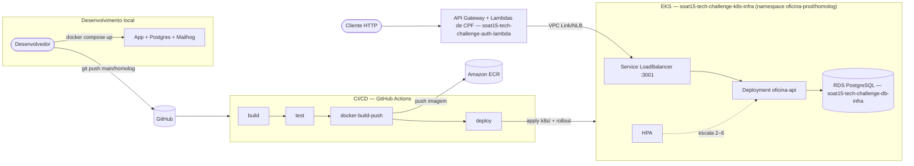

# Auto Repair Shop Management System

Sistema de gestão para oficinas mecânicas desenvolvido com **Domain-Driven Design (DDD)** e arquitetura em camadas, como Tech Challenge da Pós-Tech SOAT FIAP.

**Fase 1** entregou a aplicação (API REST completa, DDD em camadas, testes, Swagger).
**Fase 2** evolui essa base para produção: reforço de Clean Architecture, testes de
integração/E2E com Mongo real, containerização, Kubernetes com autoscaling,
provisionamento via Terraform e um pipeline de CI/CD completo. Ver
[`docs/PHASE_2_PLAN.md`](docs/PHASE_2_PLAN.md) e [`docs/PHASE_2_TASKS.md`](docs/PHASE_2_TASKS.md)
para o planejamento e o checklist detalhado da Fase 2 (arquivos locais, fora do
controle de versão — ver `.gitignore`).

---

## Objetivos

Implementar um sistema integrado que permita à oficina:

- Cadastrar e gerenciar **clientes** (PF e PJ com validação de CPF/CNPJ) e seus **veículos**
- Manter um **catálogo de peças** com controle de preços, margens e estoque
- Manter um **catálogo de serviços** com preço e tempo estimado
- Abrir, executar e encerrar **ordens de serviço** com controle de ciclo de vida
  (`RECEBIDA → EM_DIAGNOSTICO → AGUARDANDO_APROVACAO → EM_EXECUCAO → FINALIZADA → ENTREGUE`,
  com `CANCELADA` a partir dos estados não finais)
- Notificar o cliente por **e-mail** a cada mudança de status da OS
- Receber a **aprovação/recusa de orçamento** do cliente via webhook externo
- Registrar **pagamentos** em múltiplas formas
- Consultar um **dashboard** com métricas de operação

**Objetivos da Fase 2**: preparar essa aplicação para rodar de forma produtiva —
containerizada, orquestrada com autoscaling, provisionada via infraestrutura como
código, e implantada por um pipeline de CI/CD — mantendo a cobertura de testes e a
qualidade de código da Fase 1.

---

## Stack

| Camada | Tecnologia |
|---|---|
| Runtime | Node.js 20+ |
| Linguagem | TypeScript 5+ (strict) |
| Framework | Express.js 5 |
| Banco de dados | PostgreSQL 16 (`pg` + `node-pg-migrate`, sem ORM) |
| Notificação | Amazon SES (prod) ou Nodemailer/Mailhog (dev/local), por trás da mesma port |
| Logs | `pino` (JSON) + correlationId via `AsyncLocalStorage` |
| Testes | Jest + ts-jest + Supertest + Testcontainers (Postgres real) |
| Documentação | Swagger UI / OpenAPI 3.0 + collection Postman |
| Container | Docker + Docker Compose |
| Orquestração | Kubernetes — EKS real via [`soat15-tech-challenge-k8s-infra`](https://github.com/PedrosPinho/soat15-tech-challenge-k8s-infra) (manifests em `k8s/`); `kind` local só para testar manifesto sem AWS |
| Infraestrutura como código | Terraform em 3 repositórios satélite — [`db-infra`](https://github.com/PedrosPinho/soat15-tech-challenge-db-infra), [`k8s-infra`](https://github.com/PedrosPinho/soat15-tech-challenge-k8s-infra), [`auth-lambda`](https://github.com/PedrosPinho/soat15-tech-challenge-auth-lambda) |
| CI/CD | GitHub Actions (`.github/workflows/ci-cd.yml`) — build/test/push ECR/deploy EKS |
| Qualidade | SonarQube + SonarScanner |
| Segurança | JWT, bcrypt, Helmet, rate limiting |

---

## Arquitetura

```
src/
├── domain/           # Entidades, value objects, regras de negócio, interfaces de repo e de serviços (ports)
├── application/      # Use cases, DTOs, mappers
├── infrastructure/   # Repositórios Postgres, notificações (SES/Nodemailer), logger, segurança
├── presentation/     # Controllers, routes, middlewares, validators
├── main/              # Composition root (factories que fazem o wiring de dependências)
└── shared/            # Erros de domínio
```

**Princípios aplicados**: Aggregate Roots, Value Objects (CPF/CNPJ, Placa, Endereço),
Repository Pattern, Ports & Adapters para integrações externas (`INotificationService`
→ `SesNotificationService`/`NodemailerNotificationService`, selecionável por env var),
composition root isolando a montagem de
dependências da camada de rotas, imutabilidade em todas as entidades de domínio, TDD.

### Fluxo de infraestrutura (Fase 2)


```mermaid
flowchart LR
    subgraph Local["Desenvolvimento local"]
        Dev([Desenvolvedor]) -->|docker compose up| Compose[App + Postgres + Mailhog]
    end

    subgraph Pipeline["CI/CD — GitHub Actions"]
        direction LR
        Build[build] --> Test[test] --> DockerBuild[docker-build-push] --> CIDeploy[deploy]
    end

    Dev -->|git push main/homolog| GH[(GitHub)]
    GH --> Pipeline
    DockerBuild -->|push imagem| ECR[(Amazon ECR)]
    CIDeploy -->|apply k8s/ + rollout| K8s

    subgraph K8s["EKS — soat15-tech-challenge-k8s-infra (namespace oficina-prod/homolog)"]
        Svc[Service LoadBalancer :3001] --> API[Deployment oficina-api]
        HPA -.escala 2–6.-> API
        API --> RDS[(RDS PostgreSQL — soat15-tech-challenge-db-infra)]
    end

    APIGW[API Gateway + Lambdas de CPF — soat15-tech-challenge-auth-lambda] -->|VPC Link/NLB| Svc
    Cliente([Cliente HTTP]) --> APIGW
```

Diagrama completo dos 4 repositórios em
[`docs/architecture/component-diagram.md`](docs/architecture/component-diagram.md).

Detalhes de cada etapa: [`k8s/README.md`](k8s/README.md) (manifestos Kubernetes) e
[`infra/README.md`](infra/README.md) (Terraform).

---

## Quick Start

### Pré-requisitos

- Node.js 20+
- Docker e Docker Compose

### 1. Configurar variáveis de ambiente

```bash
cp .env.example .env
# edite .env — defina POSTGRES_PASSWORD, JWT_SECRET, WEBHOOK_SECRET e SONAR_TOKEN
```

### 2. Subir os serviços

```bash
docker compose up -d
```

O serviço `app` roda `npm run db:migrate` antes de subir (ver `docker-compose.yml`).
A API ficará disponível em `http://localhost:3001`, e o Mailhog (captura os e-mails
enviados quando `NOTIFICATION_PROVIDER=smtp`, o default local) em
`http://localhost:8025`.

### 3. Desenvolvimento local (sem Docker para a API)

```bash
npm install
docker compose up -d postgres mailhog   # apenas as dependências
npm run db:migrate
npm run dev
```

---

## Kubernetes e Terraform

**Deploy real (EKS)**: cluster provisionado por
[`soat15-tech-challenge-k8s-infra`](https://github.com/PedrosPinho/soat15-tech-challenge-k8s-infra)
(depende de [`db-infra`](https://github.com/PedrosPinho/soat15-tech-challenge-db-infra)
aplicado antes); os manifestos deste repositório (`k8s/`) são aplicados
automaticamente pelo CI/CD (`.github/workflows/ci-cd.yml`) a cada push em
`main`/`homolog` — ver a seção [CI/CD](#cicd) abaixo.

**Uso local sem AWS**: `infra/` provisiona um cluster **kind** efêmero (herança da
Fase 2, útil para testar mudança de manifesto sem depender de sessão do Learner Lab):

```bash
cd infra
cp terraform.tfvars.example terraform.tfvars   # preencha os valores
terraform init
terraform apply
```

Passo a passo detalhado, incluindo como instalar o `metrics-server` (necessário para o
HPA funcionar em `kind`) e como gerar carga para observar o autoscaling:
[`infra/README.md`](infra/README.md) e [`k8s/README.md`](k8s/README.md).

---

## API

### Autenticação

Endpoints marcados como protegidos exigem token JWT no header:

```
Authorization: Bearer <token>
```

**Obter token:**

```bash
POST /api/auth/login
{ "email": "admin@oficina.com", "senha": "senha123" }
```

### Endpoints

| Método | Rota | Auth | Descrição |
|--------|------|:---:|-----------|
| `GET` | `/health/live` | — | Processo vivo (nunca toca o banco) |
| `GET` | `/health/ready` | — | Postgres alcançável (200/503) — alias em `GET /health` |
| `POST` | `/api/auth/login` | — | Login |
| `POST` | `/api/clientes` | JWT | Criar cliente |
| `GET` | `/api/clientes` | JWT | Listar clientes |
| `GET` | `/api/clientes/:id` | JWT | Buscar cliente |
| `PUT` | `/api/clientes/:id` | JWT | Atualizar cliente |
| `DELETE` | `/api/clientes/:id` | JWT | Desativar cliente |
| `GET` | `/api/clientes/:id/veiculos` | JWT | Listar veículos do cliente |
| `POST` | `/api/veiculos` | JWT | Criar veículo |
| `GET` | `/api/veiculos/:id` | JWT | Buscar veículo |
| `PUT` | `/api/veiculos/:id` | JWT | Atualizar veículo |
| `POST` | `/api/pecas` | JWT | Criar peça |
| `GET` | `/api/pecas` | JWT | Listar peças (filtros: categoria, search) |
| `GET` | `/api/pecas/:id` | JWT | Buscar peça |
| `PUT` | `/api/pecas/:id` | JWT | Atualizar preço/níveis |
| `DELETE` | `/api/pecas/:id` | JWT | Desativar peça |
| `POST` | `/api/servicos` | JWT | Criar serviço no catálogo |
| `GET` | `/api/servicos` | JWT | Listar serviços |
| `GET` | `/api/servicos/:id` | JWT | Buscar serviço |
| `PUT` | `/api/servicos/:id` | JWT | Editar serviço |
| `DELETE` | `/api/servicos/:id` | JWT | Deletar serviço (soft delete) |
| `POST` | `/api/ordens-servico` | JWT | Criar OS (a partir de cpfCnpj + placa; aceita itens do catálogo de serviços) |
| `GET` | `/api/ordens-servico` | JWT | Listar OS (filtros: status, clienteId, veiculoId) — ordenada por status (execução primeiro) e esconde `FINALIZADA`/`ENTREGUE` por padrão |
| `GET` | `/api/ordens-servico/:id` | JWT | Buscar OS por id |
| `GET` | `/api/ordens-servico/buscar?cpfCnpj=` | JWT (cliente ou interno)¹ | Consulta de OS pelo CPF/CNPJ do cliente |
| `PATCH` | `/api/ordens-servico/:id/iniciar` | JWT | `RECEBIDA → EM_DIAGNOSTICO` |
| `PATCH` | `/api/ordens-servico/:id/aguardar-aprovacao` | JWT | `EM_DIAGNOSTICO → AGUARDANDO_APROVACAO` |
| `PATCH` | `/api/ordens-servico/:id/aprovar` | JWT | `AGUARDANDO_APROVACAO → EM_EXECUCAO` (uso interno) |
| `POST` | `/api/ordens-servico/:id/orcamento/webhook` | secret | Aprovação/recusa do orçamento pelo cliente (notificação externa) — `{ aprovado, motivo? }`; aprova ou cancela a OS |
| `PATCH` | `/api/ordens-servico/:id/concluir` | JWT | `EM_EXECUCAO → FINALIZADA` |
| `PATCH` | `/api/ordens-servico/:id/entregar` | JWT | `FINALIZADA → ENTREGUE` |
| `PATCH` | `/api/ordens-servico/:id/cancelar` | JWT | Cancela a OS (body: `{ motivo }`) |
| `POST` | `/api/pagamentos` | JWT | Registrar pagamento |
| `GET` | `/api/pagamentos` | JWT | Listar pagamentos |
| `GET` | `/api/pagamentos/:id` | JWT | Buscar pagamento |
| `GET` | `/api/relatorios/dashboard` | JWT | Dashboard com métricas |

Todo `JWT` na tabela acima é token de **usuário interno** (`scope: interno`, emitido
por `POST /api/auth/login`) exceto onde indicado — rotas de gestão rejeitam token de
cliente com `403`. ¹ `/buscar` aceita os dois escopos: `interno` consulta qualquer
CPF/CNPJ, `cliente` (emitido pela Lambda de CPF em `auth-lambda`) só consulta o
próprio.

O webhook de aprovação de orçamento usa um segredo compartilhado em vez de JWT de
usuário — envie o header `x-webhook-secret` com o valor configurado em `WEBHOOK_SECRET`.

A cada transição de status da OS (`iniciar`, `aguardar-aprovacao`, `aprovar`/webhook,
`concluir`, `entregar`, `cancelar`), a API dispara — de forma assíncrona, sem bloquear
a resposta HTTP — um e-mail de atualização para o cliente (Mailhog em dev/local).

### Documentação interativa

Com a API rodando, acesse:

- **Swagger UI**: http://localhost:3001/api/docs
- **OpenAPI JSON**: http://localhost:3001/api/docs.json

Para importar no Postman/Insomnia: **Import → Link** apontando para
`http://localhost:3001/api/docs.json`, ou importar a collection versionada em
[`docs/postman/oficina-api.postman_collection.json`](docs/postman/oficina-api.postman_collection.json)
(login preenche `{{token}}` automaticamente via test script).

---

## Testes

```bash
npm test                  # todos os testes
npm run test:coverage     # com relatório de cobertura
npm run test:watch        # modo watch
npm run test:unit         # só tests/domain (unitários)
npm run test:integration  # só tests/integration (E2E via supertest)
```

**Cobertura atual**: Statements 97,7% | Branches 95,1% | Functions 93,5% | Lines 98,1%
(threshold mínimo: 80%, configurado em `jest.config.js`) — 533 testes de domínio/
aplicação/apresentação + 65 de integração PostgreSQL + 9 E2E (Testcontainers).

Inclui testes de integração reais contra PostgreSQL (via Testcontainers, precisa de
Docker) e testes E2E ponta a ponta do ciclo de vida da OS, listagem/ordenação e
escopos de autorização via HTTP (`tests/integration/`).

---

## Qualidade — SonarQube

```bash
# Subir SonarQube (http://localhost:9000 — admin/admin no primeiro acesso)
npm run sonar:up

# Gerar cobertura e enviar análise
npm run sonar:scan

# Parar SonarQube
npm run sonar:down
```

Após o primeiro login no SonarQube, gere um token em **My Account → Security** e adicione ao `.env`:

```
SONAR_TOKEN=seu-token-aqui
```

---

## CI/CD

Pipeline em `.github/workflows/ci-cd.yml`, com 4 jobs a cada push/PR nas branches
`main`/`homolog` (Fase 3 — publica no ECR e implanta no EKS real de
`soat15-tech-challenge-k8s-infra`; a versão anterior, com kind efêmero e GHCR, fica
no histórico do Git):

1. **build** — `npm ci` + `npm run type-check` + `npm run build`.
2. **test** — `npm run test:coverage` contra Postgres (service container para
   `health.spec.ts`; Testcontainers para os testes de repositório e o E2E), com os
   thresholds do `jest.config.js` (mínimo 80%) como gate; publica o relatório de
   cobertura como artefato do workflow.
3. **docker-build-push** — só em push (não em PR): builda a imagem e publica no ECR
   (`soat15-tc-oficina-api:<sha>`).
4. **deploy** — só em push: `aws eks update-kubeconfig`, monta o Secret a partir do
   SSM Parameter Store (endpoint/senha do RDS, `JWT_SECRET`), roda o `Job` de
   migration, aplica `configmap`/`deployment`/`service`/`hpa` de `k8s/` (namespace
   `oficina-prod` em `main`, `oficina-homolog` em `homolog` — mesmo cluster,
   namespaces separados), espera o rollout e faz um smoke test em `/health/ready`.

### Secrets do GitHub

- `AWS_ACCESS_KEY_ID`, `AWS_SECRET_ACCESS_KEY`, `AWS_SESSION_TOKEN` — credenciais
  temporárias da sessão do AWS Academy Learner Lab (sem OIDC, IAM bloqueado).
  Renovadas por [`scripts/refresh-aws-secrets.sh`](scripts/refresh-aws-secrets.sh) no
  início de cada sessão de trabalho, nos 4 repositórios de uma vez.
- `WEBHOOK_SECRET` — não é compartilhado com nenhuma Lambda, então não tem parâmetro
  SSM; é um secret próprio deste repositório.

Se a primeira execução do dia falhar com `ExpiredToken`/`UnrecognizedClientException`,
rode o script de refresh de novo e reexecute — não é instabilidade da pipeline.

Nenhum valor real de secret está neste repositório — `JWT_SECRET`/senha do RDS vêm do
SSM Parameter Store em tempo de deploy (ver `db-infra`/`auth-lambda`).

---

## Scripts

```bash
npm run dev             # servidor em modo desenvolvimento (hot reload)
npm run build           # compila TypeScript
npm run start           # inicia versão compilada (produção)
npm run type-check      # verificação de tipos TypeScript
npm run db:migrate      # aplica migrations do Postgres (node-pg-migrate)
npm run db:migrate:down # desfaz a última migration
npm run docker:up       # sobe todos os serviços Docker
npm run docker:down     # para todos os serviços Docker
npm run docker:logs     # logs dos serviços em tempo real
```

---

## Fluxo Principal

```
1. POST /api/auth/login                          → obter token JWT
2. POST /api/clientes                             → cadastrar cliente
3. POST /api/veiculos                             → cadastrar veículo vinculado ao cliente
4. POST /api/pecas                                 → cadastrar peças no catálogo
5. POST /api/servicos                              → cadastrar serviços no catálogo
6. POST /api/ordens-servico                        → abrir OS (RECEBIDA)
7. PATCH /api/ordens-servico/:id/iniciar            → iniciar diagnóstico (EM_DIAGNOSTICO)
8. PATCH /api/ordens-servico/:id/aguardar-aprovacao → orçamento pronto (AGUARDANDO_APROVACAO)
9. POST /api/ordens-servico/:id/orcamento/webhook   → cliente aprova (EM_EXECUCAO) ou recusa (CANCELADA)
10. PATCH /api/ordens-servico/:id/concluir          → serviço finalizado (FINALIZADA)
11. PATCH /api/ordens-servico/:id/entregar          → veículo entregue (ENTREGUE)
12. POST /api/pagamentos                            → registrar pagamento
13. GET  /api/relatorios/dashboard                  → consultar métricas
```

A cada passo 7–11, o cliente recebe um e-mail automático com a atualização de status.

---


## Licença

Tech Challenge — Pós-Tech SOAT FIAP
