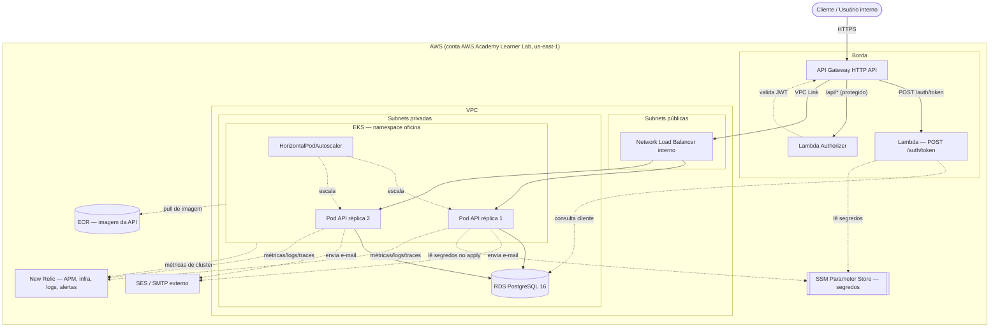

# Diagrama de Componentes — Fase 3 (Cloud)

> Visão de implantação em nuvem. Para o desenho de camadas do código (DDD), ver o
> diagrama existente no [`README.md`](../../README.md). Este documento cobre a
> topologia de infraestrutura descrita em [`PHASE_3_PLAN.md`](../PHASE_3_PLAN.md).

## Visão geral

## Componentes e responsabilidade

| Componente | Responsabilidade | Repositório |
|---|---|---|
| API Gateway (HTTP API) | Borda pública, roteamento, throttling, integração com Lambdas e VPC Link | `soat15-tech-challenge-auth-lambda` |
| Lambda `POST /auth/token` | Valida CPF, consulta cliente no RDS, emite JWT com `scope: cliente` | `soat15-tech-challenge-auth-lambda` |
| Lambda Authorizer | Valida JWT (assinatura, expiração, situação do cliente) para rotas `/api/*` | `soat15-tech-challenge-auth-lambda` |
| NLB interno | Alvo do VPC Link, expõe o `Service` do EKS só dentro da VPC | `soat15-tech-challenge-k8s-infra` |
| EKS + HPA | Roda a API principal (Node.js/Express), escala por CPU | `soat15-tech-challenge-k8s-infra` (cluster) / este repo (manifestos e imagem) |
| RDS PostgreSQL 16 | Persistência relacional (clientes, veículos, OS, peças, pagamentos, usuários) | `soat15-tech-challenge-db-infra` |
| SSM Parameter Store | Segredos (`SecureString`): credenciais do RDS, `JWT_SECRET` | `soat15-tech-challenge-db-infra` (parâmetros do banco) / `auth-lambda` (JWT) |
| ECR | Registro da imagem Docker da API | `soat15-tech-challenge-k8s-infra` |
| SES / SMTP externo | Implementação de `INotificationService` (e-mail de mudança de status de OS) | este repo (`SesNotificationService`) |
| New Relic | APM, métricas de infraestrutura K8s, logs correlacionados, dashboards e alertas | este repo (agente) + `k8s-infra` (Helm `nri-bundle`) |

## Notas de desenho

- **API Gateway não fala diretamente com pods**: passa por VPC Link → NLB interno, porque o cluster fica em subnets privadas sem exposição pública direta.
- **Sem NAT Gateway** (restrição de orçamento do Learner Lab): a Lambda de autenticação só precisa alcançar o RDS (dentro da VPC) e o SSM (via *Interface VPC Endpoint*, se necessário); os nós do EKS ficam em subnets públicas com security group restrito para poder alcançar o ECR/SSM sem NAT. Ver `ADR-006` para a decisão de segurança associada (`LabRole` compartilhada).
- **Duas linhas de defesa de autenticação**: o Lambda Authorizer valida na borda, e o `authMiddleware` da aplicação valida de novo a assinatura do JWT — o Service do EKS nunca confia cegamente na borda.
