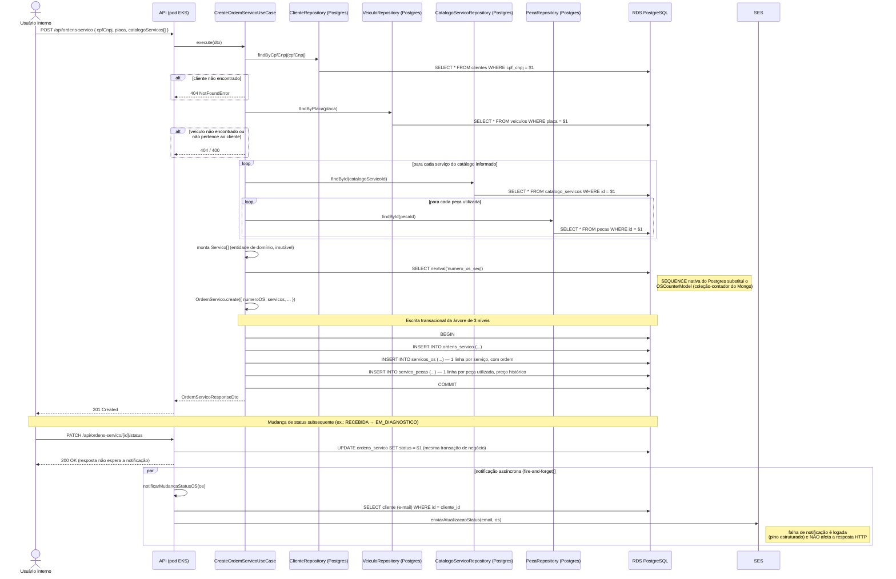

# Diagrama de Sequência — Abertura de Ordem de Serviço

Cobre `POST /api/ordens-servico` (`CreateOrdemServicoUseCase`) já com a persistência em
PostgreSQL (Etapa 1) e, na sequência, a primeira transição de status disparando a
notificação assíncrona (`notificarMudancaStatusOS`, inalterado desde a Fase 2 — ver
`ADR-005`).

## Pontos de atenção

- **Escrita transacional**: como a entidade `OrdemServico` é imutável e sempre chega inteira ao repositório (`save()`), o `INSERT`/`DELETE`+`INSERT` dos filhos (`servicos_os`, `servico_pecas`) roda dentro de uma única transação — um erro em qualquer INSERT reverte a árvore inteira, evitando o estado parcial que uma escrita multi-tabela não transacional permitiria.
- **`nextval` fora da transação de negócio não é um problema aqui**: `SEQUENCE` do Postgres é não transacional por design (evita lock/serialização entre criações concorrentes de OS) — um `numeroOS` "furado" por causa de um rollback é aceitável e documentado, era o mesmo comportamento do `$inc` atômico do Mongo.
- **Notificação nunca bloqueia a resposta HTTP**: padrão já estabelecido na Fase 2 (`notificarMudancaStatusOS` é fire-and-forget com `.catch` próprio) e mantido na Fase 3 — só a implementação por trás da port `INotificationService` muda (SES no lugar de SMTP/Nodemailer). Ver `ADR-005`.
