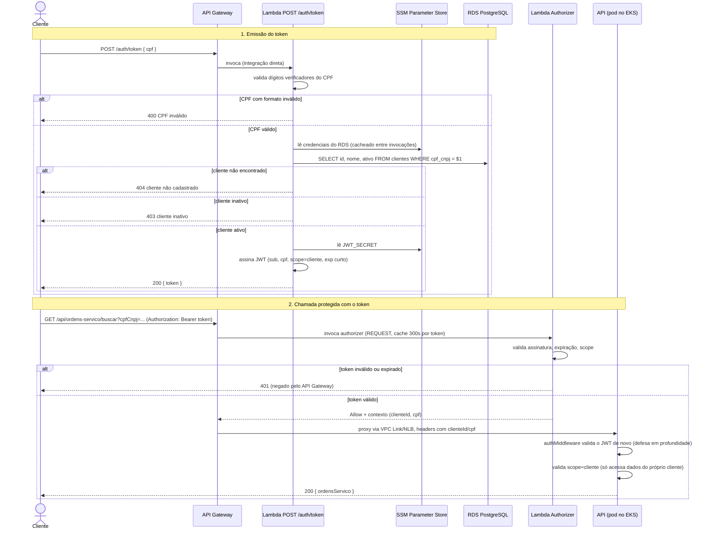

# Diagrama de Sequência — Autenticação por CPF

Fluxo completo: emissão do token a partir do CPF e uso do token numa chamada
protegida da API. Ver decisão em [`rfcs/RFC-003-autenticacao.md`](rfcs/RFC-003-autenticacao.md).

## Pontos de atenção

- **Nunca diferenciar 404 (não cadastrado) de 403 (inativo) por mensagem pública** — evita enumeração de CPFs cadastrados. A diferenciação existe só no log estruturado (`correlationId`).
- **O `authMiddleware` da aplicação não confia apenas no Lambda Authorizer**: valida a assinatura do JWT de novo, localmente, antes de qualquer lógica de negócio — ver `RFC-003` para a justificativa completa.
- **Cache do Authorizer (300s)**: um token revogado (ex.: cliente desativado depois de emitido o token) pode continuar válido pela borda até o cache expirar; a validação de `ativo` acontece só na emissão. Risco aceito e documentado — o token já tem expiração curta.
